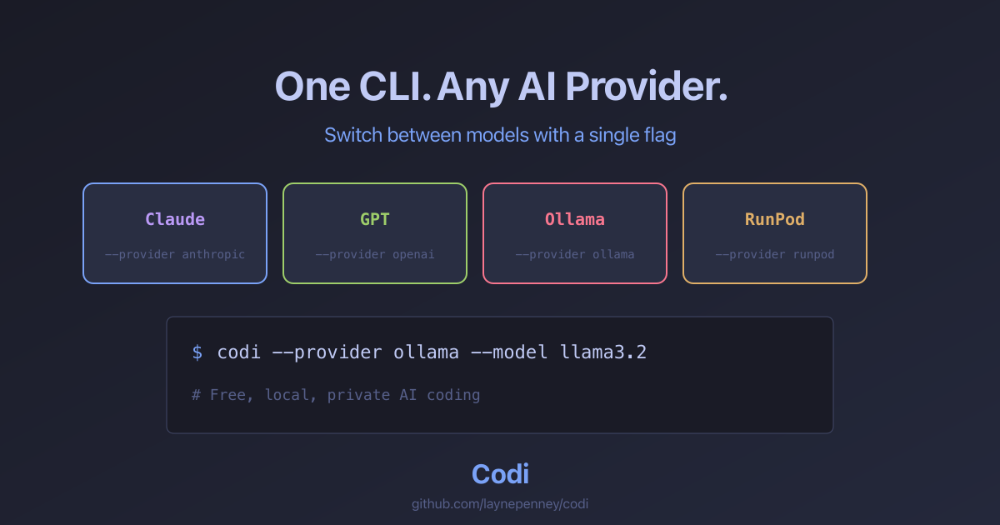

<p align="center">
  
</p>

<p align="center">
  <strong>Your AI coding wingman for the terminal</strong>
</p>

<p align="center">
  <a href="https://github.com/laynepenney/codi/actions/workflows/ci.yml"></a>
  <a href="#installation"></a>
  <a href="#quick-start"></a>
  <a href="#quick-start"></a>
  <a href="#quick-start"></a>
  <a href="LICENSE"></a>
</p>

<p align="center">
  <a href="https://laynepenney.github.io/codi/">Website</a> •
  <a href="#features">Features</a> •
  <a href="#installation">Installation</a> •
  <a href="#quick-start">Quick Start</a> •
  <a href="#commands">Commands</a> •
  <a href="#tools">Tools</a> •
  <a href="#extending-codi">Extend</a>
</p>

<p align="center">
  
</p>

---

## Highlights

<p align="center">
  
  
</p>
<p align="center">
  
</p>

---

## Features

<table>
<tr>
<td width="50%">

### 🔌 Multi-Provider Support
Switch between Claude, OpenAI, Ollama (local or cloud-hosted), or RunPod serverless endpoints with a single flag.

### 🛠️ Powerful Tool System
AI can read/write files, search code, execute commands, apply patches, analyze images, and search the web.

### ⚡ Smart Project Context
Auto-detects project type, language, framework, and adapts responses accordingly.

</td>
<td width="50%">

### 🎯 Code Assistance Commands
Built-in slash commands for explaining, refactoring, testing, reviewing, and documenting code.

### 🔒 Safety First
Dangerous operations require user approval. Diff previews before file changes. Full undo history.

### 🧩 Extensible Architecture
Easy to add new tools, commands, providers, and plugins.

### 🔄 Interactive Workflows
Create multi-step workflows with AI model switching, conditional logic, loops, and built-in actions. Supports automated PR reviews, code refactoring pipelines, and CI/CD automation.

```yaml
- id: create-pr
  action: create-pr
  title: "Automated feature"
- id: cheap-review
  action: switch-model
  model: "claude-haiku"
- id: review
  action: review-pr
  check: "approved"
- id: merge
  action: merge-pr
```

</td>
</tr>
</table>

---

## Installation

### Via npm (Recommended)

```bash
npm install -g codi-cli
```

### From Source

**Requirements:**
- Node.js `>=22 <23`
- pnpm (via Corepack)

```bash
# Clone the repository
git clone https://github.com/laynepenney/codi.git
cd codi

# Install dependencies
corepack enable
pnpm install

# Build the project
pnpm run build

# Optional: Link globally
pnpm link --global
```

### Platform Notes

<details>
<summary><strong>Windows</strong></summary>

**Windows is not currently supported.** We recommend using WSL2 (Windows Subsystem for Linux) for the best experience.

See [GitHub issue #134](https://github.com/laynepenney/codi/issues/134) for details.

</details>

<details>
<summary><strong>macOS</strong></summary>

Works out of the box. For Ollama local models:
```bash
brew install ollama
ollama serve  # In a separate terminal
ollama pull llama3.2
```

</details>

<details>
<summary><strong>Linux</strong></summary>

Works out of the box. Ensure Node.js 22+ is installed:
```bash
# Using nvm
nvm install 22
nvm use 22
```

</details>

---

## Quick Start

### With Claude API (Anthropic)
```bash
export ANTHROPIC_API_KEY="your-key-here"
codi
```

**Get your API key:** [console.anthropic.com](https://console.anthropic.com/)

**Available models:** `claude-sonnet-4-20250514` (default), `claude-3-5-haiku-latest`, `claude-opus-4-20250514`

### With OpenAI API
```bash
export OPENAI_API_KEY="your-key-here"
codi --provider openai
```

**Get your API key:** [platform.openai.com/api-keys](https://platform.openai.com/api-keys)

**Available models:** `gpt-4o` (default), `gpt-4o-mini`, `o1-preview`, `o1-mini`

### With Ollama (Local/Free)
```bash
# 1. Install Ollama from https://ollama.ai
# 2. Start the server (runs on localhost:11434)
ollama serve

# 3. Pull a model (in another terminal)
ollama pull llama3.2

# 4. Run Codi
codi --provider ollama --model llama3.2
```

**Recommended models:** `llama3.2` (fast), `deepseek-coder` (code), `qwen2.5-coder` (code)

### With Ollama Cloud (Hosted)
```bash
# Sign in to Ollama Cloud (one-time setup)
ollama signin

# Or use an API key from https://ollama.com/settings/keys
export OLLAMA_API_KEY="your-api-key"

# Run with cloud models
codi --provider ollama-cloud --model llama3.2
```

**Get your API key:** [ollama.com/settings/keys](https://ollama.com/settings/keys)

### With RunPod Serverless
```bash
export RUNPOD_API_KEY="your-key-here"
codi --provider runpod --endpoint-id your-endpoint-id
```

**Get your API key:** [runpod.io/console/user/settings](https://runpod.io/console/user/settings)

---

## CLI Options

| Option | Description | Default |
|--------|-------------|---------|
| `-p, --provider <type>` | Provider: `anthropic`, `openai`, `ollama`, `ollama-cloud`, `runpod`, or `auto` | `auto` |
| `-m, --model <name>` | Model name to use | Provider default |
| `--base-url <url>` | Custom API base URL | Provider default |
| `--endpoint-id <id>` | Endpoint ID for RunPod serverless | - |
| `-y, --yes` | Auto-approve all tool operations | Prompt |
| `--no-tools` | Disable tool use (for models that don't support it) | Tools enabled |
| `-s, --session <name>` | Load a saved session on startup | - |
| `--resume [name]` | Resume the most recent session for this working directory (or a specific session) | - |
| `-c, --compress` | Enable context compression | Disabled |
| `--context-window <tokens>` | Context window size before compaction | Model default |
| `--summarize-model <name>` | Model for context summarization | Primary model |
| `--summarize-provider <type>` | Provider for summarization model | Primary provider |
| `--mcp-server` | Run as MCP server (stdio transport) | - |
| `--no-mcp` | Disable MCP server connections | MCP enabled |
| `--audit` | Enable audit logging to ~/.codi/audit/ | Disabled |
| `--verbose` | Show tool inputs/outputs with timing | - |
| `--debug` | Show API details and context info | - |
| `--trace` | Show full request/response payloads | - |

### Child Mode (Multi-Agent)

These options are used internally when spawning worker agents:

| Option | Description |
|--------|-------------|
| `--child-mode` | Run as child agent (connects to commander via IPC) |
| `--socket-path <path>` | IPC socket path for permission routing |
| `--child-id <id>` | Unique worker identifier |
| `--child-task <task>` | Task description for the worker |

---

## Keyboard Shortcuts

Codi supports several keyboard shortcuts for efficient interaction:

| Shortcut | Description |
|----------|-------------|
| **ESC** | Interrupt current AI processing and return to prompt |
| **Ctrl+C** | Submit current line without starting a new one |
| **Ctrl+C (twice quickly)** | Force quit Codi |
| **↑/↓** | Navigate command history |
| **Tab** | Tab completion for files and commands |

**ESI Interrupt Feature:** Press ESC at any time during AI processing to cancel and return to the prompt. This is useful for:
- Long-running tool calls (e.g., test suites)
- Mistaken commands with large operations
- Infinite loops or stuck operations
- Quick iterations without waiting for completion

---

## Commands

<details>
<summary><strong>📝 Information Prompts</strong></summary>

| Command | Description |
|---------|-------------|
| `/prompt explain <file>` | Explain code in a file |
| `/prompt review <file>` | Code review for a file |
| `/prompt analyze <file>` | Analyze code structure |
| `/prompt summarize <file>` | Summarize code purpose |

</details>

<details>
<summary><strong>🛠️ Code Actions</strong></summary>

| Command | Aliases | Description |
|---------|---------|-------------|
| `/code refactor <file> [focus]` | `/refactor`, `/r` | Refactor code for quality |
| `/code fix <file> <issue>` | `/fix`, `/f` | Fix a bug or issue |
| `/code test <file> [function]` | `/test`, `/t` | Generate tests |
| `/code doc <file>` | - | Generate documentation |
| `/code optimize <file>` | - | Optimize for performance |

</details>

<details>
<summary><strong>🔀 Git Integration</strong></summary>

| Command | Aliases | Description |
|---------|---------|-------------|
| `/git commit [type]` | `/commit`, `/ci` | Generate a commit message |
| `/git branch [action] [name]` | `/branch`, `/br` | Manage branches |
| `/git diff [target]` | - | Show and explain differences |
| `/git pr [base]` | `/pr` | Generate a PR description |
| `/git stash [action]` | - | Manage git stash |
| `/git log [target]` | - | Show and explain history |
| `/git status` | - | Show detailed status |
| `/git undo [what]` | - | Safely undo changes |
| `/git merge <branch>` | - | Merge with conflict guidance |
| `/git rebase <branch>` | - | Rebase with safety warnings |

</details>

<details>
<summary><strong>💾 Session Management</strong></summary>

Sessions auto-save after each response; use `/save` to name or snapshot a session.

| Command | Description |
|---------|-------------|
| `/save [name]` | Save current conversation |
| `/load <name>` | Load a previously saved session |
| `/sessions` | List all saved sessions |
| `/sessions info [name]` | Show session details |
| `/sessions delete <name>` | Delete a saved session |
| `/label [text]` | Set/show conversation label (displayed in prompt) |

</details>

<details>
<summary><strong>🧠 Memory System</strong></summary>

| Command | Description |
|---------|-------------|
| `/remember [category:] <fact>` | Remember a fact for future sessions |
| `/forget <pattern>` | Remove memories matching pattern |
| `/memories [query]` | List or search stored memories |
| `/profile` | View your user profile |
| `/profile set <key> <value>` | Update profile preferences |

</details>

<details>
<summary><strong>🔧 Interactive Workflows</strong></summary>

### Workflow Execution
| Command | Aliases | Description |
|---------|---------|-------------|
| `/workflow list` | `/workflow ls` | List available workflows |
| `/workflow show <name>` | `/workflow view` | Show workflow details and steps |
| `/workflow validate <name>` | - | Validate workflow syntax |
| `/workflow-run <name>` | `/wr` | Execute or resume a workflow |

### Workflow Development
| Command | Description |
|---------|-------------|
| `/new <type> <name>` | Create new component, hook, service, etc. |
| `/scaffold <feature>` | Scaffold a complete feature |
| `/debug <issue>` | Help debug an issue |
| `/setup <tool>` | Set up tooling (eslint, prettier, testing) |
| `/migrate <from> <to>` | Migrate code patterns |

**Example workflow YAML**:
```yaml
name: pr-review-loop
description: Automated PR review with model switching
steps:
  - id: create-pr
    action: create-pr
    title: "Automated PR"
  - id: cheap-review
    action: switch-model
    model: "claude-haiku"
  - id: review
    action: review-pr
    check: "approved"
```
</details>

<details>
<summary><strong>⚙️ Model & Config</strong></summary>

| Command | Aliases | Description |
|---------|---------|-------------|
| `/init [--config\|--modelmap\|--context]` | - | Initialize Codi config files in project |
| `/models [provider]` | - | List available models with pricing |
| `/switch <provider> [model]` | `/use` | Switch provider/model mid-session |
| `/config [show\|init\|example]` | `/cfg` | View or create workspace configuration |
| `/modelmap` | `/mm` | Show model map configuration |
| `/pipeline [name] [input]` | `/pipe` | Execute or list multi-model pipelines |

</details>

<details>
<summary><strong>🔍 Symbol Index (Code Navigation)</strong></summary>

| Command | Aliases | Description |
|---------|---------|-------------|
| `/symbols rebuild` | `/sym`, `/index` | Rebuild the symbol index |
| `/symbols update` | - | Incremental update of changed files |
| `/symbols stats` | - | Show index statistics |
| `/symbols search <name>` | - | Search for symbols by name |
| `/symbols clear` | - | Clear the index |

The symbol index enables IDE-like code navigation for the AI.

</details>

<details>
<summary><strong>📦 Context Management</strong></summary>

| Command | Aliases | Description |
|---------|---------|-------------|
| `/compact` | `/compress` | Show context status |
| `/compact summarize` | - | Summarize older messages to reduce context |
| `/compact compress [on\|off]` | - | Toggle entity-based compression |
| `/revert-file` | `/rf`, `/fileundo` | Undo the last file change |
| `/filehistory` | `/fh` | Show file change history |
| `/redo` | - | Redo an undone change |

</details>

<details>
<summary><strong>📊 Usage & Cost Tracking</strong></summary>

| Command | Aliases | Description |
|---------|---------|-------------|
| `/usage` | `/cost`, `/tokens` | Show current session usage |
| `/usage today` | - | Show today's usage |
| `/usage week` | - | Show last 7 days usage |
| `/usage month` | - | Show last 30 days usage |
| `/usage all` | - | Show all-time usage |
| `/usage reset` | - | Reset session usage |

</details>

<details>
<summary><strong>📝 Planning</strong></summary>

| Command | Aliases | Description |
|---------|---------|-------------|
| `/plan <task>` | `/p` | Create a step-by-step plan for a task |
| `/plans` | - | List saved plans |
| `/plans show <id>` | - | Show a specific plan |
| `/plans delete <id>` | - | Delete a plan |

</details>

<details>
<summary><strong>🤖 Multi-Agent Orchestration</strong></summary>

Run multiple AI agents in parallel, each in isolated git worktrees:

| Command | Description |
|---------|-------------|
| `/delegate <branch> <task>` | Spawn a worker agent in a new worktree |
| `/workers` | List active workers and their status |
| `/workers cancel <id>` | Cancel a running worker |
| `/worktrees` | List all managed worktrees |
| `/worktrees cleanup` | Remove completed worktrees |

**Example workflow:**
```bash
# Spawn workers for parallel tasks
/delegate feat/auth "implement OAuth2 login"
/delegate feat/api "add REST endpoints for users"

# Monitor progress
/workers

# Workers route permission requests to you for approval
# [feat/auth] Permission: write_file → approve/deny?
```

</details>

<details>
<summary><strong>🔍 RAG (Semantic Search)</strong></summary>

| Command | Aliases | Description |
|---------|---------|-------------|
| `/index` | `/reindex` | Build or rebuild the RAG code index |
| `/index --clear` | - | Clear and rebuild index from scratch |
| `/index --status` | - | Show indexing status |
| `/rag search <query>` | - | Search indexed code semantically |
| `/rag stats` | - | Show RAG index statistics |
| `/rag config` | - | Show RAG configuration |

</details>

<details>
<summary><strong>✅ Approvals</strong></summary>

| Command | Aliases | Description |
|---------|---------|-------------|
| `/approvals` | `/approved` | List approved command patterns |
| `/approvals add pattern <regex>` | - | Add an approved pattern |
| `/approvals add category <name>` | - | Add an approved category |
| `/approvals remove pattern <regex>` | - | Remove a pattern |
| `/approvals categories` | - | List available categories |

</details>

---

## Tools

The AI has access to these tools for interacting with your codebase:

| Tool | Description |
|------|-------------|
| `read_file` | Read file contents with optional line range |
| `write_file` | Create or overwrite files |
| `edit_file` | Make targeted search/replace edits |
| `insert_line` | Insert text at a specific line number |
| `patch_file` | Apply unified diff patches |
| `glob` | Find files by pattern (e.g., `src/**/*.ts`) |
| `grep` | Search file contents with regex |
| `list_directory` | List files and directories with sizes |
| `print_tree` | Print tree-like directory structure |
| `bash` | Execute shell commands (with safety checks) |
| `analyze_image` | Analyze images using vision models |
| `run_tests` | Auto-detect and run project tests |
| `web_search` | Search the web (no API key needed) |
| `refactor` | Multi-file search and replace |
| `generate_docs` | Extract documentation from source files |

### Symbol Index Tools

The AI can use these tools for IDE-like code navigation:

| Tool | Description |
|------|-------------|
| `find_symbol` | Find symbol definitions by name (functions, classes, types) |
| `find_references` | Find all files that import or use a symbol |
| `get_dependency_graph` | Show file-level import/export dependencies |
| `get_call_graph` | Show potential callers of a function |
| `rebuild_index` | Rebuild the symbol index |
| `get_index_status` | Check index status and freshness |

> **Note:** Run `/symbols rebuild` to build the index before using symbol tools.

### Safety Features

Dangerous operations trigger confirmation prompts:
- Destructive bash commands (`rm -rf`, `sudo`, etc.)
- Force git operations (`--force`)
- System modifications (`chmod 777`, disk operations)
- Remote script execution (piped curl/wget)

**Diff Preview**: See exactly what will change before approving file modifications.

**Undo System**: Use `/revert-file` to undo any file change.

---

## Project Detection

Codi automatically detects your project type and adapts its responses:

| Project Type | Detection | Frameworks Detected |
|--------------|-----------|---------------------|
| **Node.js** | `package.json` | React, Next.js, Vue, Angular, Express, Fastify, NestJS |
| **Python** | `pyproject.toml`, `requirements.txt` | Django, Flask, FastAPI |
| **Rust** | `Cargo.toml` | - |
| **Go** | `go.mod` | - |

---

## Workspace Configuration

Create a `.codi.json` in your project root (or use `/init --config`):

```json
{
  "provider": "anthropic",
  "model": "claude-sonnet-4-20250514",
  "baseUrl": "https://api.example.com",
  "autoApprove": ["read_file", "glob", "grep", "list_directory"],
  "approvedCategories": ["read-only", "navigation"],
  "dangerousPatterns": ["custom-pattern-.*"],
  "systemPromptAdditions": "Always use TypeScript strict mode.",
  "projectContext": "This is a React app using Next.js 14.",
  "commandAliases": {
    "t": "/test src/",
    "b": "/build"
  },
  "defaultSession": "my-project",
  "enableCompression": false,
  "maxContextTokens": 100000,
  "models": {
    "summarize": {
      "provider": "ollama",
      "model": "llama3.2"
    }
  },
  "rag": {
    "enabled": true,
    "excludePatterns": ["**/node_modules/**", "**/.git/**"],
    "maxChunkSize": 1000,
    "maxResults": 5
  },
  "tools": {
    "disabled": ["web_search"],
    "defaults": {
      "bash": { "timeout": 30000 }
    }
  }
}
```

### Configuration Options

| Option | Description |
|--------|-------------|
| `provider` | Default provider: `anthropic`, `openai`, `ollama`, `ollama-cloud`, `runpod` |
| `model` | Default model name |
| `baseUrl` | Custom API base URL |
| `autoApprove` | Array of tools to auto-approve (skip confirmation) |
| `approvedCategories` | Bash command categories to auto-approve |
| `dangerousPatterns` | Custom regex patterns to flag as dangerous |
| `systemPromptAdditions` | Text appended to system prompt |
| `projectContext` | Project description for AI context |
| `commandAliases` | Custom command shortcuts |
| `defaultSession` | Session to load on startup |
| `enableCompression` | Enable entity-based context compression |
| `maxContextTokens` | Context window override |
| `models.summarize` | Secondary model for summarization |
| `rag.enabled` | Enable/disable RAG semantic search |
| `rag.excludePatterns` | Glob patterns to exclude from indexing |
| `tools.disabled` | Array of tools to disable |
| `tools.defaults` | Default parameters for tools |

---

## Model Map (Multi-Model Orchestration)

Create `codi-models.yaml` for Docker-compose style multi-model workflows:

```yaml
version: "1"

models:
  haiku:
    provider: anthropic
    model: claude-3-5-haiku-latest
  sonnet:
    provider: anthropic
    model: claude-sonnet-4-20250514
  local:
    provider: ollama
    model: llama3.2

tasks:
  fast: { model: haiku }
  code: { model: sonnet }
  complex: { model: sonnet }

model-roles:
  fast:
    anthropic: haiku
    openai: gpt-5-nano
    ollama: local
  capable:
    anthropic: sonnet
    openai: gpt-5
    ollama: local

pipelines:
  code-review:
    description: "Multi-step code review"
    steps:
      - name: scan
        role: fast
        prompt: "Quick scan: {input}"
        output: issues
      - name: analyze
        role: capable
        prompt: "Deep analysis: {issues}"
        output: analysis
    result: "{analysis}"
```

```bash
# Execute pipeline with different providers
/pipeline code-review src/agent.ts
/pipeline --provider anthropic code-review src/agent.ts
```

---

## Extending Codi

### Adding a Tool

```typescript
// src/tools/my-tool.ts
import { BaseTool } from './base.js';

export class MyTool extends BaseTool {
  getDefinition() {
    return {
      name: 'my_tool',
      description: 'Description for the AI',
      input_schema: {
        type: 'object',
        properties: {
          param: { type: 'string', description: 'Parameter' }
        },
        required: ['param']
      }
    };
  }

  async execute(input: Record<string, unknown>) {
    return 'Result';
  }
}
```

### Adding a Command

```typescript
// src/commands/my-commands.ts
import { registerCommand } from './index.js';

export const myCommand = {
  name: 'mycommand',
  aliases: ['mc'],
  description: 'Description shown in /help',
  usage: '/mycommand <arg>',
  execute: async (args) => `Perform task with: ${args}`,
};

registerCommand(myCommand);
```

### Plugins (Coming Soon)

Plugin support is temporarily disabled while we improve the architecture. The plugin system will allow custom commands, tools, and providers via `~/.codi/plugins/`.

---

## Development

```bash
pnpm dev          # Run with TypeScript
pnpm test         # Run tests
pnpm test:watch   # Watch mode
pnpm build        # Build for production
```

### PTY Integration Tests
```bash
CODI_RUN_PTY_TESTS=1 pnpm test
```

---

## Architecture

```
codi/
├── src/
│   ├── index.ts           # CLI entry point & REPL
│   ├── agent.ts           # Agent loop orchestration
│   ├── context.ts         # Project detection
│   ├── commands/          # Slash command system
│   ├── providers/         # AI model backends
│   ├── tools/             # Filesystem interaction
│   ├── rag/               # Semantic code search
│   ├── model-map/         # Multi-model orchestration
│   ├── orchestrate/       # Multi-agent orchestration (IPC, worktrees)
│   └── symbol-index/      # Code symbol indexing
├── tests/                 # Vitest test suite
├── docs/                  # Documentation
└── assets/                # Branding assets
```

---

## Contributing

1. Fork the repository
2. Create a feature branch (`git checkout -b feature/amazing-feature`)
3. Make your changes
4. Run tests (`pnpm test`)
5. Commit (`git commit -m 'Add amazing feature'`)
6. Push (`git push origin feature/amazing-feature`)
7. Open a Pull Request

See [CODI.md](./CODI.md) for detailed contribution guidelines.


## 🗺️ Roadmap

**Current Status**: Workflow System Phase 2 Complete ✅

### ✅ Completed Features
- **Multi-provider support** (Claude, OpenAI, Ollama)
- **Comprehensive tool suite** (28+ file, git, code tools)
- **Git integration** (/commit, /pr, /branch commands)
- **Session persistence** with conversation history
- **Session debugging** with breakpoints and checkpoints
- **Multi-agent orchestration** with IPC communication
- **Cost/usage tracking** with historical analytics
- **RAG system** for semantic code search
- **Web search** via DuckDuckGo
- **Model map** for multi-model workflows
- **Interactive workflow system** (Phase 1-2)

### 🔄 Recent Major Updates (Jan 2025)

**Interactive Workflow System** ✅ Phase 1-2 Complete
- Execute multi-step workflows with model switching
- YAML-based workflow definition
- State persistence and progress tracking
- `/workflow list/show/validate/run` commands
- Cross-provider model switching

### 🔲 Planned Features
- **Workflow Phase 3**: Conditional logic and branching
- **Workflow Phase 4**: Loop support with safety limits
- **Enhanced MCP support**: Better tool interoperability
- **Visual debugging**: GUI for session debugging
- **Team features**: Collaborative workflows

See [workflow-status-roadmap.md](workflow-status-roadmap.md) for detailed development plan.

---

<details>
<summary><strong>API Key Issues</strong></summary>

**"API key not found"**
- Ensure the environment variable is set: `echo $ANTHROPIC_API_KEY`
- Check for typos in the variable name
- For persistent setup, add to your shell profile (`~/.bashrc`, `~/.zshrc`)

**"Invalid API key"**
- Verify the key at your provider's dashboard
- Check for leading/trailing whitespace: `export ANTHROPIC_API_KEY="$(echo $ANTHROPIC_API_KEY | xargs)"`
- Ensure the key has proper permissions (some providers have read-only keys)

</details>

<details>
<summary><strong>Ollama Issues</strong></summary>

**"Connection refused" or "ECONNREFUSED"**
- Ensure Ollama is running: `ollama serve`
- Check it's on the right port: `curl http://localhost:11434/api/tags`
- If using a different host: `export OLLAMA_HOST=http://your-host:11434`

**"Model not found"**
- Pull the model first: `ollama pull llama3.2`
- List available models: `ollama list`
- Model names are case-sensitive

**Slow responses**
- First request downloads the model (can take minutes)
- Use smaller models for faster responses: `llama3.2` vs `llama3.1:70b`
- Check available RAM (models load into memory)

</details>

<details>
<summary><strong>Node.js Issues</strong></summary>

**"Unsupported engine" or version errors**
- Codi requires Node.js 22+
- Check version: `node --version`
- Install via nvm: `nvm install 22 && nvm use 22`

**pnpm not found**
- Enable corepack: `corepack enable`
- Or install directly: `npm install -g pnpm`

</details>

<details>
<summary><strong>Permission Issues</strong></summary>

**File permission denied**
- Codi runs with your user permissions
- Check file ownership: `ls -la file`
- Don't run as root/sudo

**Tool confirmation keeps appearing**
- Add trusted tools to config: `"autoApprove": ["read_file", "glob"]`
- Use `-y` flag to auto-approve all (use with caution)

</details>

<details>
<summary><strong>Memory/Performance Issues</strong></summary>

**High memory usage in long sessions**
- Use `/compact summarize` to reduce context size
- Sessions auto-compact when approaching token limits
- Restart codi for a fresh context

**Slow responses**
- Check your API rate limits
- Use a faster model (Haiku vs Opus)
- Enable compression: `codi --compress`

</details>

<details>
<summary><strong>Git/Worktree Issues</strong></summary>

**"fatal: not a git repository"**
- Initialize git: `git init`
- Multi-agent features require a git repo

**Worktree conflicts**
- List worktrees: `git worktree list`
- Clean up: `/worktrees cleanup`
- Manual cleanup: `git worktree remove <path>`

</details>

---

## License

AGPL-3.0-or-later (see [LICENSE](./LICENSE))

Commercial licenses available for proprietary use. See [LICENSING.md](./LICENSING.md) for details.

---

<p align="center">
  
</p>

<p align="center">
  Built with 💜 by developers, for developers
</p>
