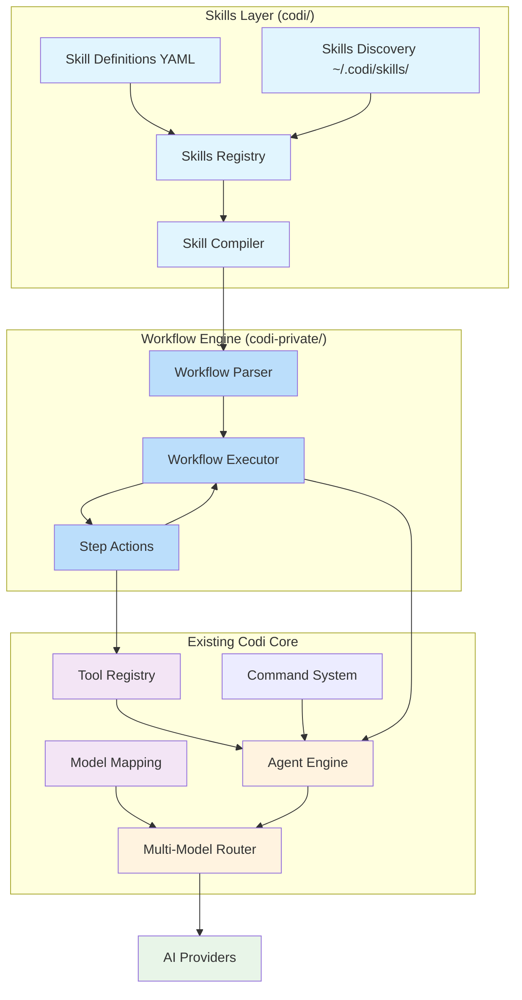

# Codi Skills System Implementation Guide

## Overview

The Codi Skills System transforms Codi from a general-purpose coding assistant into a powerful workflow automation platform. Skills are YAML-defined workflows that orchestrate multiple AI steps, tool calls, and model routing to accomplish complex coding tasks.

This guide provides a comprehensive implementation plan for integrating the Skills System into Codi's existing architecture.

## High-Level Architecture

Skills provide a **user-friendly interface layer** that compiles to the robust **workflow execution engine** from `codi-private`. Workflows are the engine; skills are the interface.



### Key Architecture Principle

**Workflows are THE ENGINE** | **Skills are THE INTERFACE**

- Skills provide: Natural language abstractions, model type aliases, simplified syntax
- Workflows provide: Actual execution, step-by-step actions, state management, multi-model orchestration
- The Skill Compiler translates high-level skill definitions into concrete workflow YAML that the codi-private workflow executor can run

## Implementation Phases

### Phase 1: Skills Definition & Registry (Week 1)

#### 1.1 Skills Format vs Workflow Format

**Skills provide a simplified interface** that compiles to the existing workflow YAML format used by `codi-private`.

**Skill Definition (User-Facing):**
```yaml
# refactor-javascript.yaml
name: "refactor-javascript"
version: "1.0.0"
description: "Comprehensive JavaScript refactoring workflow"
category: "code-quality"

parameters:
  - name: "file"
    type: "string"
    description: "File to refactor"
    required: true

workflow:
  - step: "analyze"
    description: "Analyze code structure"
    model: "complex"
    prompt: |
      Analyze the code in {{file}} for refactoring opportunities.

  - step: "plan"
    description: "Create refactoring plan"
    model: "complex"
    prompt: |
      Create a step-by-step refactoring plan.

  - step: "implement"
    description: "Execute refactoring"
    model: "code"
    tools: ["read_file", "edit_file", "run_tests"]
    prompt: |
      Implement the refactoring plan.
```

**Compiled Workflow (Actual Execution):**
```yaml
# refactor-javascript.compiled.yaml
name: refactor-javascript
description: Comprehensive JavaScript refactoring workflow
persistent: true

steps:
  - id: analyze
    action: ai-prompt
    description: Analyze code structure
    model: claude-sonnet-4-20250514
    prompt: |
      Analyze the code in {{file}} for refactoring opportunities.

  - id: plan
    action: ai-prompt
    description: Create refactoring plan
    model: claude-sonnet-4-20250514
    prompt: |
      Create a step-by-step refactoring plan.

  - id: implement
    action: ai-prompt
    description: Execute refactoring
    model: gpt-4o
    prompt: |
      Implement the refactoring plan.
```

### Compilation Transformations

| Skill Feature | Compiled To | Example |
|--------------|-------------|---------|
| `model: "complex"` | Concrete model name | `claude-sonnet-4-20250514` |
| `model: "code"` | Code-optimized model | `gpt-4o` |
| `model: "fast"` | Fast inference model | `claude-3-5-haiku-latest` |
| `tools: [...]` | Action: `shell` with tool calls | Delegated to executor |
| `{{variable}}` | Workflow variable substitution | Preserved as is |
| `step: "name"` | `id: "name"` (action defaults to `ai-prompt`) | Implicit action |

#### 1.2 Skills Registry + Compiler Implementation

Files:
- `src/skills/registry.ts` - Skills discovery and registration
- `src/skills/compiler.ts` - Compile skill YAML to workflow YAML
- `src/skills/model-resolver.ts` - Resolve model aliases to concrete model names

**Skills Discovery:**
- Load skill definitions from `~/.codi/skills/` and local `.codi/skills/`
- Hot-reload capability for development
- Integration with existing plugin system

**Compilation Pipeline:**
```
Skill Definition → Model Resolution → Workflow Generation → Validation → Execution
```

**Model Resolution Strategy:**
- `model: "complex"` → mapped to user's best complex model (Sonnet, etc.)
- `model: "code"` → mapped to code-optimized model (GPT-4o, etc.)
- `model: "fast"` → mapped to fastest available model (Haiku, etc.)
- Resolved from `codi`'s existing `model-map` configuration

## Repository Structure

### codi (Public Repository)

The public Codi repository where the skills interface layer lives:

```
codi/
├── src/
│   ├── skills/              # Skills interface layer
│   │   ├── registry.ts     # Skill discovery and loading
│   │   ├── compiler.ts     # Skill → workflow compilation
│   │   ├── executor.ts     # Workflow executor wrapper
│   │   ├── model-resolver.ts
│   │   └── commands/
│   ├── agent.ts            # Main Agent class
│   ├── model-map.ts        # Model configuration
│   └── tools/
├── package.json
└── docs/
    └── SKILLS-SYSTEM-IMPLEMENTATION-GUIDE.md
```

### codi-private (Private Repository)

The private repository containing the workflow engine and advanced features:

```
codi-private/
├── src/
│   ├── executor.ts         # Core WorkflowExecutor
│   ├── parser.ts           # YAML workflow parser
│   ├── manager.ts          # Workflow lifecycle management
│   ├── state.ts            # State persistence
│   ├── types.ts            # Workflow type definitions
│   ├── ux.ts               # Workflow UX/display
│   └── steps/              # Step action implementations
│       ├── ai-prompt.ts
│       ├── shell.ts
│       ├── switch-model.ts
│       ├── conditional.ts
│       ├── loop.ts
│       ├── interactive.ts
│       ├── git-actions.ts
│       └── ...
├── workflows/              # Built-in workflows
│   ├── pr-review-workflow.yaml
│   └── multi-model-peer-review.yaml
└── package.json            # Exports as @codi/workflows
```

### Repository Relationship

1. **codi-private** provides the workflow engine package `@codi/workflows`
2. **codi** depends on `@codi/workflows` as a workspace dependency
3. **Skills layer** (in codi) compiles user-friendly YAML to workflow YAML (for codi-private)
4. **WorkflowExecutor** (from codi-private) handles all execution
5. **Codi Agent** adapts to `WorkflowAgent` interface required by executor

```yaml
# pnpm-workspace.yaml
packages:
  - 'codi'
  - 'codi-private'
```

#### 1.3 Skills Command Integration

File: `src/commands/skills-commands.ts`

Commands:
- `/skills list` - List all available skills
- `/skills run <skill>` - Execute a skill
- `/skills info <skill>` - Display skill details
- `/skill <name> [parameters]` - Shortcut syntax for skill execution

### Phase 2: Workflow Engine Integration (Week 2)

#### 2.1 Workflow Executor Integration

The workflow executor from `codi-private` handles all execution. Skills provide the compiled workflow.

**Integration Architecture:**

```typescript
// src/skills/executor.ts
import { WorkflowExecutor } from '@codi-private/workflows';

export class SkillExecutor {
  private workflowExecutor: WorkflowExecutor;

  constructor(private agent: WorkflowAgent) {
    // Reuse the battle-tested workflow executor
    this.workflowExecutor = new WorkflowExecutor(agent);
  }

  async executeSkill(
    skillName: string,
    parameters: Record<string, any>
  ): Promise<ExecutionResult> {
    // 1. Load skill definition
    const skill = SkillsRegistry.getSkill(skillName);
    if (!skill) throw new Error(`Skill not found: ${skillName}`);

    // 2. Compile skill to workflow
    const workflow = SkillCompiler.compile(skill, parameters);

    // 3. Execute via workflow executor
    return await this.workflowExecutor.execute(workflow, {
      variables: parameters,
      persistent: true
    });
  }
}
```

**State Management:**
- Workflow state is persisted to `~/.codi/skills/state/`
- Resume interrupted skill execution from workflow checkpoints
- Track step history and results

#### 2.2 Model Mapping Resolution

Leverage existing `codi` `model-map` system for model alias resolution:

```typescript
// src/skills/model-resolver.ts
import { getModel, modelMap } from '../model-map';

export const MODEL_ALIASES = {
  'complex': modelMap.complex, // e.g., "claude-sonnet-4-20250514"
  'code': modelMap.code,       // e.g., "gpt-4o"
  'fast': modelMap.fast,       // e.g., "claude-3-5-haiku-latest"
  'embedding': modelMap.embedding
};

export function resolveModel(alias: string): string {
  const model = MODEL_ALIASES[alias];
  if (!model) {
    // If user specified a concrete model, use it directly
    return alias;
  }
  return model;
}
```

#### 2.3 Action Handling (Workflow Step Types)

Skills compile to workflow actions. The executor delegates each action type:

| Workflow Action | Handler | Purpose |
|----------------|---------|---------|
| `ai-prompt` | Agent chat | Execute AI prompts with specified model |
| `shell` | Executor | Run commands via bash tool |
| `switch-model` | Agent | Switch AI model mid-workflow |
| `conditional` | Executor | Branching logic based on conditions |
| `loop` | Executor | Repeat steps with conditions |
| `interactive` | UX layer | Prompt user for input |
| `check-file-exists` | Executor | Validate file state |
| `create-pr`, `review-pr`, `merge-pr` | Git handlers | PR operations |
| `commit`, `push`, `pull`, `sync` | Git handlers | Git operations |

These actions are already implemented in `codi-private/src/steps/`.

### Phase 3: Skill Authoring & Development Tools (Week 3)

#### 3.1 Skill Development Kit

New CLI commands:
- `codi skill create <name>` - Bootstrap new skills
- `codi skill test <skill>` - Test skill execution
- `codi skill validate <skill>` - Validate skill definition
- `codi skill publish <skill>` - Share skills with community

#### 3.2 Skill Templates

Common skill templates for:
- Code refactoring
- Test generation
- Documentation generation
- Bug fixing workflows
- Deployment pipelines

#### 3.3 Skill Validation System

Validation includes:
- Schema validation against skill manifest spec
- Parameter validation
- Dependency checking
- Security audit for tool usage

### Phase 4: Advanced Features (Week 4)

#### 4.1 Conditional Execution

Features:
- `if/then/else` logic in workflows
- Looping constructs for repetitive tasks
- Error handling and recovery strategies
- Parallel step execution

#### 4.2 Skill Composition

Features:
- Skills calling other skills
- Parameter passing between skills
- Composite skill creation
- Skill dependency management

#### 4.3 Performance Optimization

Optimizations:
- Skill result caching
- Incremental execution
- Progress tracking and resumption
- Background skill execution

## Integration Points

### Commands System Integration

Extend Command interface:
```typescript
// Extend Command interface
interface Command {
  name: string;
  aliases?: string[];
  description: string;
  usage: string;
  taskType?: string;
  subcommands?: string[];
  execute: (args: string, context: CommandContext) => Promise<string | null>;
  skill?: SkillDefinition;          // Skill execution capability
  usesSkills?: string[];            // Skill composition support
}
```

### Agent Integration

Bridge the `codi` Agent to the workflow executor's interface:

```typescript
// src/skills/agent-adapter.ts
import { Agent } from '../agent';
import { WorkflowAgent, Workflow, WorkflowStep } from '@codi-private/workflows';

/**
 * Adapter bridging Codi's Agent to WorkflowAgent interface
 * required by codi-private's WorkflowExecutor.
 */
export class WorkflowAgentAdapter implements WorkflowAgent {
  constructor(private agent: Agent) {}

  async chat(prompt: string, options?: { model?: string }): Promise<string> {
    // Use agent's existing prompt execution
    return await this.agent.executePrompt(prompt, {
      model: options?.model
    });
  }

  async executeTool(toolName: string, args: Record<string, unknown>): Promise<unknown> {
    // Use agent's existing tool execution
    return await this.agent.executeTool(toolName, args);
  }

  async switchModel(model: string): Promise<unknown> {
    // Use agent's existing model switching
    return await this.agent.switchModel(model);
  }

  get provider() {
    // Expose provider info if available
    return this.agent.provider;
  }
}
```

**Usage in SkillExecutor:**
```typescript
const agentAdapter = new WorkflowAgentAdapter(agent);
const skillExecutor = new SkillExecutor(agentAdapter);
```

### Tool Registry Integration

Tool registry enhancements:
```typescript
class ToolRegistry {
  registerSkill(skill: SkillDefinition): void {
    // Register skill as a special type of tool
  }
  
  getSkill(name: string): SkillDefinition | undefined {
    // Retrieve skill definition
  }
}
```

## File Structure

### Skills Directory Structure

```
~/.codi/skills/
├── builtin/                 # Core Codi skills
│   ├── refactor-code.yaml
│   ├── generate-tests.yaml
│   ├── code-review.yaml
│   └── documentation.yaml
├── community/              # User-contributed skills
│   ├── react/
│   ├── nodejs/
│   └── python/
└── local/                  # Project-specific skills
    └── project-name/
```

### Source Code Structure

```
src/skills/
├── index.ts                    # Main exports
├── registry.ts                 # Skills discovery and registration
├── compiler.ts                 # Skill to workflow compilation
├── executor.ts                 # Workflow executor wrapper
├── model-resolver.ts           # Model alias resolution
├── agent-adapter.ts            # Agent → WorkflowAgent bridge
├── validator.ts                # Skill definition validation
├── templates/                  # Skill templates for common patterns
│   ├── refactor.ts
│   ├── test-generation.ts
│   └── documentation.ts
└── commands/
    ├── skills-commands.ts      # User-facing commands
    └── skill-helpers.ts        # Command utilities

# Workflow engine (imported from codi-private)
@codi-private/workflows/ (package)
├── types.ts                    # Workflow type definitions
├── executor.ts                 # Core workflow execution
├── parser.ts                   # YAML workflow parsing
├── manager.ts                  # Workflow state management
├── state.ts                    # State persistence
└── steps/                      # Step action implementations
    ├── ai-prompt.ts
    ├── shell.ts
    ├── switch-model.ts
    ├── conditional.ts
    ├── loop.ts
    ├── interactive.ts
    └── git-actions.ts
```

## Sample Skills Implementation

### 1. Code Refactoring Skill

**Skill Definition:**
```yaml
# ~/.codi/skills/refactor-code.yaml
name: "refactor-code"
description: "Standard code refactoring workflow"
category: "code-quality"

parameters:
  - name: "file"
    type: "string"
    description: "File to refactor"
    required: true

workflow:
  - step: "analyze"
    description: "Analyze file for refactoring opportunities"
    model: "complex"
    prompt: |
      Analyze {{file}} for refactoring opportunities focusing on:
      - Code complexity and readability
      - Design patterns and structure
      - Performance issues
      - Security vulnerabilities

  - step: "create-plan"
    description: "Create detailed refactoring plan"
    model: "complex"
    prompt: |
      Create a step-by-step refactoring plan with:
      1. Specific changes needed
      2. Order of operations
      3. Testing strategy
      4. Risk assessment

  - step: "implement"
    description: "Execute refactoring changes"
    model: "code"
    tools: ["read_file", "edit_file", "run_tests"]
    prompt: |
      Implement the refactoring plan step by step.
      Run tests after each major change.
```

**Compiled Workflow:**
```yaml
# Generated by SkillCompiler
name: refactor-code
description: Standard code refactoring workflow
persistent: true

steps:
  - id: analyze
    action: ai-prompt
    description: Analyze file for refactoring opportunities
    model: claude-sonnet-4-20250514
    prompt: |
      Analyze {{file}} for refactoring opportunities focusing on:
      - Code complexity and readability
      - Design patterns and structure
      - Performance issues
      - Security vulnerabilities

  - id: create-plan
    action: ai-prompt
    description: Create detailed refactoring plan
    model: claude-sonnet-4-20250514
    prompt: |
      Create a step-by-step refactoring plan with:
      1. Specific changes needed
      2. Order of operations
      3. Testing strategy
      4. Risk assessment

  - id: implement
    action: ai-prompt
    description: Execute refactoring changes
    model: gpt-4o
    prompt: |
      Implement the refactoring plan step by step.
      Run tests after each major change.
```

### 2. Test Generation Skill

**Skill Definition:**
```yaml
name: "generate-tests"
description: "Comprehensive test generation"
category: "testing"

parameters:
  - name: "file"
    type: "string"
    description: "File to generate tests for"
    required: true
  - name: "coverage"
    type: "string"
    description: "Coverage target (low, medium, high)"
    default: "mid"

workflow:
  - step: "analyze-coverage"
    description: "Analyze existing test coverage"
    model: "fast"
    action: shell
    command: "npm test -- --coverage {{file}}"

  - step: "identify-gaps"
    description: "Identify test gaps"
    model: "complex"
    prompt: |
      Analyze {{file}} and identify:
      1. Functions without tests
      2. Edge cases not covered
      3. Error handling missing tests

  - step: "generate-tests"
    description: "Generate missing tests"
    model: "code"
    tools: ["write_file", "run_tests"]
    prompt: |
      Generate comprehensive tests for gaps identified.

  - step: "verify"
    description: "Run tests to verify"
    action: shell
    command: "npm test -- {{file}}"
```

### 3. Multi-Model PR Review (Leveraging Existing Workflow)

This skill actually reuses the existing workflow from `codi-private`:

**Skill Definition:**
```yaml
name: "pr-review-workflow"
description: "Comprehensive PR review using multiple models"
category: "code-review"

workflow:
  # Reference existing workflow - no compilation needed
  use-workflow: "codi-private/workflows/pr-review-workflow.yaml"

  # Or inline the workflow steps
  steps:
    - step: "analyze-pr-changes"
      action: ai-prompt
      model: "fast"
      prompt: |
        Analyze this PR by examining:
        1. Files changed and scope
        2. Architecture implications
        3. Potential risk areas
        4. Testing completeness

    - step: "switch-to-sonnet"
      action: switch-model
      model: "complex"

    - step: "detailed-review"
      action: ai-prompt
      model: "complex"
      prompt: |
        Perform comprehensive code review focusing on:
        - Code quality and maintainability
        - Error handling and edge cases
        - Performance and security

    - step: "alternative-perspective"
      action: switch-model
      model: "code"

    - step: "review-alternative"
      action: ai-prompt
      model: "code"
      prompt: |
        Review from different angle:
        - Modern practices
        - User experience
        - System impact
```

**This demonstrates two approaches:**
1. **Direct workflow reference** - Point to existing workflow YAML
2. **Inline skill definition** - Define steps using skill syntax that compiles to workflow actions

## Technical Implementation Details

### Skills Registry Class

```typescript
// src/skills/registry.ts
import { promises as fs } from 'fs';
import * as yaml from 'js-yaml';
import { join, homedir } from 'path';

export interface SkillDefinition {
  name: string;
  version: string;
  description: string;
  category?: string;
  parameters?: Parameter[];
  workflow: SkillWorkflow;
}

export interface Parameter {
  name: string;
  type: 'string' | 'number' | 'boolean' | 'array';
  description: string;
  required?: boolean;
  default?: unknown;
}

export interface SkillWorkflow {
  steps: SkillStep[];
  useWorkflow?: string; // Direct reference to existing workflow
}

export interface SkillStep {
  step: string;
  description?: string;
  model?: string; // Alias: 'complex', 'code', 'fast'
  action?: string; // Direct workflow action
  tools?: string[];
  prompt?: string;
  command?: string;
  file?: string;
}

export class SkillsRegistry {
  private skills = new Map<string, SkillDefinition>();

  async loadSkills(): Promise<void> {
    const directories = [
      join(homedir(), '.codi', 'skills'),
      '.codi', 'skills',
      join(process.cwd(), 'workflows') // Legacy codi workflows path
    ];

    for (const dir of directories) {
      try {
        const skillFiles = await this.findSkillFiles(dir);
        for (const file of skillFiles) {
          const skill = await this.loadSkillFile(file);
          this.skills.set(skill.name, skill);
        }
      } catch (error) {
        // Directory doesn't exist, skip
      }
    }
  }

  private async findSkillFiles(dir: string): Promise<string[]> {
    const { glob } = await import('glob');
    return glob('**/*.yaml', { cwd: dir, absolute: true });
  }

  private async loadSkillFile(path: string): Promise<SkillDefinition> {
    const content = await fs.readFile(path, 'utf-8');
    const parsed = yaml.load(content) as SkillDefinition;
    return parsed;
  }

  getSkill(name: string): SkillDefinition | undefined {
    return this.skills.get(name);
  }

  listAllSkills(): SkillDefinition[] {
    return Array.from(this.skills.values());
  }
}
```

### Skill Compiler

```typescript
// src/skills/compiler.ts
import { SkillDefinition, SkillStep } from './registry';
import { Workflow, WorkflowStep } from '@codi-private/workflows';
import { resolveModel } from './model-resolver';
import * as yaml from 'js-yaml';
import { promises as fs } from 'fs';
import { join, homedir } from 'path';

export class SkillCompiler {
  static compile(
    skill: SkillDefinition,
    parameters: Record<string, unknown>
  ): Workflow {
    // If skill references existing workflow directly
    if (skill.workflow.useWorkflow) {
      return this.loadExistingWorkflow(skill.workflow.useWorkflow);
    }

    return {
      name: skill.name,
      description: skill.description,
      version: skill.version,
      persistent: true,
      variables: parameters,
      steps: skill.workflow.steps.map((step, index) =>
        this.compileStep(step, index)
      )
    };
  }

  private static loadExistingWorkflow(path: string): Workflow {
    // Load workflow from codi-private or custom path
    const content = fs.readFileSync(path, 'utf-8');
    return yaml.load(content) as Workflow;
  }

  private static compileStep(step: SkillStep, index: number): WorkflowStep {
    const baseStep = {
      id: step.step,
      description: step.description
    };

    // If action is explicitly specified (advanced usage)
    if (step.action) {
      return {
        ...baseStep,
        action: step.action as any,
        ...this.getStepSpecificFields(step)
      };
    }

    // Default to ai-prompt action
    return {
      ...baseStep,
      action: 'ai-prompt',
      model: step.model ? resolveModel(step.model) : resolveModel('complex'),
      prompt: step.prompt
    } as any;
  }

  private static getStepSpecificFields(step: SkillStep): Partial<WorkflowStep> {
    const fields: Partial<WorkflowStep> = {};

    if (step.model) {
      fields.model = resolveModel(step.model);
    }

    if (step.prompt) {
      fields.prompt = step.prompt;
    }

    if (step.command) {
      fields.command = step.command;
    }

    if (step.file) {
      fields.file = step.file;
    }

    return fields;
  }

  static async saveCompiledWorkflow(
    skillName: string,
    workflow: Workflow
  ): Promise<string> {
    const stateDir = join(homedir(), '.codi', 'skills', 'compiled');
    await fs.mkdir(stateDir, { recursive: true });

    const path = join(stateDir, `${skillName}.workflow.yaml`);
    const yamlStr = yaml.dump(workflow);
    await fs.writeFile(path, yamlStr);

    return path;
  }
}
```

### Model Resolver

```typescript
// src/skills/model-resolver.ts
import { modelMap } from '../model-map';

/**
 * Model aliases that skills can use for abstraction.
 * These map to concrete model names via the model-map system.
 */
export const MODEL_ALIASES = {
  complex: modelMap.complex || 'claude-sonnet-4-20250514',
  code: modelMap.code || 'gpt-4o',
  fast: modelMap.fast || 'claude-3-5-haiku-latest',
  embedding: modelMap.embedding || 'text-embedding-3-small'
};

/**
 * Resolve a model alias to a concrete model name.
 * If the alias isn't recognized, assume it's a concrete model.
 */
export function resolveModel(alias: string): string {
  const model = MODEL_ALIASES[alias as keyof typeof MODEL_ALIASES];
  return model || alias;
}

/**
 * Get all available model aliases.
 */
export function getModelAliases(): Record<string, string> {
  return MODEL_ALIASES;
}
```

## Security Considerations

1. **Sandboxed Execution**: Skills run with same permissions as Codi
2. **Parameter Validation**: All parameters validated before execution
3. **Tool Permissions**: Maintain existing safety model for tool usage
4. **Skill Validation**: Skills validated before registration
5. **Audit Logging**: All skill executions logged for security

## Performance Considerations

1. **Caching**: Skill results cached for repeated executions
2. **Incremental Execution**: Resume interrupted skill executions
3. **Parallel Processing**: Leverage multi-agent system for parallel steps
4. **Resource Management**: Connection pooling for model providers

## Compatibility Strategy

1. **Backward Compatibility**: Maintain existing command system
2. **Gradual Migration**: Commands can be refactored as skills
3. **Dual Interface**: Support both command and skill execution
4. **Migration Path**: Provide tools for command-to-skill conversion

## Testing Strategy

### Unit Tests

Components to test:
- Skill definition validation
- Execution engine functionality
- Error handling and rollback
- Integration with existing systems

### Integration Tests

Scenarios to test:
- End-to-end skill execution
- Multi-agent skill workflows
- Performance and reliability

### Acceptance Tests

Real-world validation:
- Real-world coding scenarios
- User experience validation
- Community skill testing

## Success Metrics

1. **Complex Workflows**: Ability to create workflows with 5+ steps
2. **Parameter Support**: Full parameterization capability
3. **Multi-Agent Integration**: Seamless parallel execution
4. **Community Adoption**: Skill sharing and discovery
5. **Performance**: Skill execution within reasonable time limits

## Implementation Timeline and Milestones

### Week 1: Core Infrastructure (codi)
- [ ] Create `@codi/skills` package structure in codi/src/skills/
- [ ] Implement SkillsRegistry for loading from ~/.codi/skills/ and .codi/skills/
- [ ] Implement ModelResolver using existing model-map
- [ ] Define TypeScript types for skill definitions
- [ ] Implement basic skill discovery and loading

### Week 2: Workflow Engine Integration
- [ ] Add codi-private as dependency (@codi/workflows package)
- [ ] Implement WorkflowAgentAdapter to bridge Agent to WorkflowAgent interface
- [ ] Implement SkillCompiler to transform skill YAML to workflow YAML
- [ ] Implement SkillExecutor using WorkflowExecutor from codi-private
- [ ] Test compilation and execution with sample skills

### Week 3: Commands and UX
- [ ] Implement skills commands (list, info, run)
- [ ] Add skill execution to command system
- [ ] Implement skill parameter prompts
- [ ] Add progress tracking and state display
- [ ] Create example skills for testing

### Week 4: Authoring Tools and Polish
- [ ] Implement skill development CLI (create, validate, test)
- [ ] Create skill templates for common patterns
- [ ] Add skill validation against schema
- [ ] Implement compilation preview (show generated workflow)
- [ ] Document skill authoring process

### Week 5: Advanced Features
- [ ] Support direct workflow references (use-workflow syntax)
- [ ] Implement conditional execution support (when/then/else)
- [ ] Add support for all workflow action types (shell, git, loops, etc.)
- [ ] Implement skill state persistence and resumption
- [ ] Add error handling and workflow rollback

## Package Dependencies

### New Dependencies for codi

```json
{
  "dependencies": {
    "@codi/workflows": "workspace:*",
    "js-yaml": "^4.1.0",
    "glob": "^10.3.0"
  }
}
```

### codi-private Package Export

`codi-private/package.json` needs to export types and executor:

```json
{
  "name": "@codi/workflows",
  "exports": {
    ".": {
      "types": "./src/types.ts",
      "default": "./src/index.ts"
    }
  }
}
```

## Build and Package Structure

```
monorepo/
├── codi                          # Main package
│   ├── package.json              # Depends on @codi/workflows
│   └── src/
│       ├── skills/               # Skills system
│       └── ...
├── codi-private                  # Workflow engine package
│   ├── package.json              # Exports @codi/workflows
│   └── src/                      # Workflow implementation
│       ├── types.ts
│       ├── executor.ts
│       ├── parser.ts
│       └── steps/
└── pnpm-workspace.yaml           # Workspace config
```

## Future Enhancements

### Phase 5: Ecosystem Development
- Skill marketplace
- Automated skill testing
- Skill versioning and updates
- Collaborative skill development

### Phase 6: Advanced Orchestration
- Cross-project skill execution
- Distributed skill execution
- Real-time collaboration
- Advanced scheduling

## Appendix A: Skills Directory Structure Examples

```
~/.codi/skills/
├── builtin/
│   ├── code-quality/
│   │   ├── refactor-code.yaml
│   │   ├── generate-tests.yaml
│   │   └── code-review.yaml
│   ├── documentation/
│   │   ├── generate-readme.yaml
│   │   └── generate-docs.yaml
│   └── deployment/
│       ├── dockerize-app.yaml
│       └── deploy-to-cloud.yaml
├── community/
│   ├── frontend/
│   │   ├── react/
│   │   │   ├── component-generator.yaml
│   │   │   └── hooks-library.yaml
│   │   └── vue/
│   │       └── component-scaffolding.yaml
│   └── backend/
│       ├── nodejs/
│       │   ├── express-api.yaml
│       │   └── database-migration.yaml
│       └── python/
│           ├── flask-api.yaml
│           └── django-setup.yaml
└── local/
    └── my-project/
        ├── project-setup.yaml
        ├── ci-cd-pipeline.yaml
        └── custom-refactor.yaml
```

## Appendix B: CLI Commands Reference

| Command | Description | Example |
|---------|-------------|---------|
| `/skills list` | List all registered skills | `/skills list` |
| `/skills info <skill>` | Show detailed information about a skill | `/skills info refactor-code` |
| `/skills run <skill> [params]` | Execute a skill with parameters | `/skills run refactor-code file=src/app.js` |
| `/skill <name> [params]` | Shortcut for skill execution | `/skill generate-tests file=src/utils.js` |
| `codi skill create <name>` | Create a new skill template | `codi skill create my-custom-skill` |
| `codi skill validate <skill>` | Validate a skill definition | `codi skill validate my-custom-skill` |

## Appendix C: YAML Schema Definitions

### Skill Definition Schema

```yaml
# Skill Definition (User-Facing Format)
name: string                    # Required: Skill identifier
version: string                # Required: Version (semver)
description: string            # Required: Human-readable description
category: string              # Optional: Category grouping
author: string                # Optional: Author information
tags: string[]               # Optional: Searchable tags

parameters:                   # Optional: Input parameters
  - name: string              # Parameter name
    type: string              # Data type: 'string'|'number'|'boolean'|'array'
    description: string      # Description
    required: boolean        # Required flag (default: false)
    default: any            # Default value

workflow:                     # Required: Execution specification
  use-workflow: string       # Optional: Direct reference to existing workflow
  steps:                     # Either use-workflow OR steps
    - step: string           # Step identifier
      description: string    # Step description
      model: string          # Model alias: 'complex'|'code'|'fast'|concrete
      action: string         # Optional: Workflow action (default: 'ai-prompt')
      tools: string[]        # Optional: Tools for this step
      prompt: string         # Optional: Prompt template
      command: string        # For 'shell' action
      file: string           # For file-related actions
```

### Compiled Workflow Schema

```yaml
# Compiled Workflow (Actual Execution Format - codi-private types)
name: string                    # Workflow name
description: string            # Workflow description
version: string                # Version
interactive: boolean           # Enable interactive prompts (default: false)
persistent: boolean            # Persist state (default: false)
variables: object              # Initial variable values

steps:                         # Required: Execution steps
  - id: string                # Step identifier
    action: string            # Required Action type:
                              #   'ai-prompt'|'shell'|'switch-model'
                              #   'conditional'|'loop'|'interactive'
                              #   'check-file-exists'|'create-pr'|'review-pr'
                              #   'merge-pr'|'commit'|'push'|'pull'|'sync'
    description: string       # Step description
    
    # Action-specific fields:
    model: string             # For ai-prompt, switch-model
    prompt: string            # For ai-prompt
    command: string           # For shell
    check: string             # For conditional
    onTrue: string            # For conditional
    onFalse: string           # For conditional (optional)
    to: string                # For loop: target step
    condition: string         # For loop
    maxIterations: number     # For loop (optional)
    prompt: string            # For interactive
    inputType: string         # For interactive: text|password|confirm|choice|multiline
    timeoutMs: number         # For interactive (optional)
    file: string              # For check-file-exists
    title, body, base: string # For PR actions
    message, base: string     # For git actions
```

### Model Alias Resolution

```yaml
# Model aliases map to concrete model names via model-map
aliases:
  complex: -> modelMap.complex      # Usually Claude Sonnet
  code: -> modelMap.code            # Usually GPT-4o
  fast: -> modelMap.fast            # Usually Claude Haiku
  embedding: -> modelMap.embedding  # Text embedding model

# Concrete models can be specified directly in skills
model: "claude-sonnet-4-20250514"  # Exact model name
model: "gpt-4o"                     # Exact model name
model: "llama3.2"                   # OpenAI-compatible via Ollama
```

## Conclusion

The Codi Skills System represents a significant evolution of the platform, transforming it from a reactive coding assistant into a proactive workflow automation tool. By leveraging the existing multi-agent orchestration, model routing, and safety features, we can create a powerful system that empowers users to build complex, reusable coding workflows.

This system will make Codi more accessible to teams and organizations, enabling standardized coding practices and accelerating development workflows while maintaining the safety and reliability that defines the Codi experience.

Wingman: Codi <codi@layne.pro>